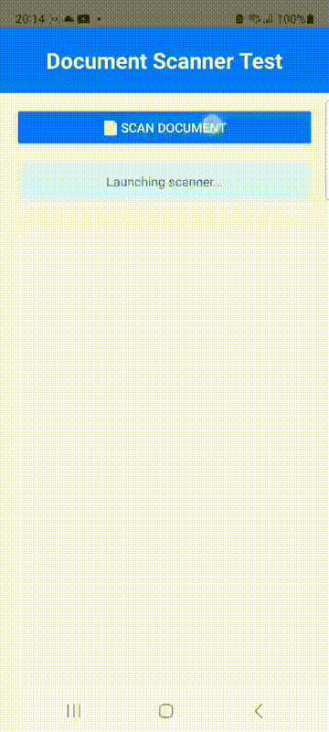

# react-native-document-scanner

[](https://www.npmjs.com/package/@dariyd/react-native-document-scanner) [](./LICENSE)

Fast, native React Native document scanner for iOS and Android using Apple VisionKit (iOS) and Google ML Kit (Android). Features automatic document detection, edge/perspective correction, multi‑page scanning, configurable image quality, optional Base64, and support for the React Native New Architecture on ios and android.

- **iOS**: Uses VisionKit framework and VNDocumentCameraViewController
- **Android**: Uses ML Kit Document Scanner API

## Preview

| iOS Demo | Android Demo |
|----------|--------------|
|  |  |


## Used in Production Apps

| [FileNest AI - Docs Organizer](https://apps.apple.com/us/app/filenest-ai-docs-organizer/id6756841050) | [MyGarage - CarDocs & History](https://apps.apple.com/us/app/mygarage-cardocs-history/id6757166595) |
|:---:|:---:|
| [](https://apps.apple.com/us/app/filenest-ai-docs-organizer/id6756841050) | [](https://apps.apple.com/us/app/mygarage-cardocs-history/id6757166595) |

## Features

- 📱 Cross-platform support (iOS 13+ and Android API 21+)
- 🚀 iOS & Android: Full support for new React Native architecture (Fabric/TurboModules)
- 📸 Automatic document detection and scanning
- 🖼️ Multi-page document scanning
- ⚙️ Configurable image quality
- 📦 Optional base64 encoding
- 🎯 Platform parity - same API for both platforms

> Keywords: React Native document scanner, VisionKit document scanner, ML Kit document scanner, scan documents React Native, edge detection, perspective correction, multi‑page scanner

## Installation

### From npm (Recommended)

```bash
npm install @dariyd/react-native-document-scanner
```

or with yarn:

```bash
yarn add @dariyd/react-native-document-scanner
```

### From GitHub (Latest Development)

```bash
npm install https://github.com/dariyd/react-native-document-scanner.git
```

or

```bash
yarn add https://github.com/dariyd/react-native-document-scanner.git
```

### iOS Installation

```bash
cd ios && pod install
```

### Android Installation

No additional steps required. The ML Kit dependency will be automatically included.

## Post-install Steps

### iOS

Add the `NSCameraUsageDescription` key to your `Info.plist`:

```xml
<key>NSCameraUsageDescription</key>
<string>We need access to your camera to scan documents</string>
```

### Android

Add camera permission to your `AndroidManifest.xml`:

```xml
<uses-permission android:name="android.permission.CAMERA" />
```

The module automatically requests camera permission when launching the scanner.

## React Native New Architecture

This module requires **React Native 0.77.3 or higher** and supports the new architecture on iOS, while using the stable old architecture on Android.

**iOS**: Full support for Fabric and TurboModules - automatically detected and enabled when you enable new architecture in your project.

**Android**: Uses the stable bridge implementation for maximum compatibility. New architecture support is planned for a future release.

### Requirements

- **React Native 0.77.3 or higher**
- **React 18.2.0 or higher**
- iOS 13.0 or higher
- **Android**:
  - Minimum SDK: API 21 (Android 5.0)
  - Target SDK: API 35 (Android 15) - required by Google Play Store
  - Compile SDK: API 35

### Enabling New Architecture

**✅ iOS**: Fully supported - Set `RCT_NEW_ARCH_ENABLED=1` in your Podfile or build settings

**✅ Android**:  Fully supported - Keep `newArchEnabled=true` in your `gradle.properties`

The iOS implementation will automatically use Fabric/TurboModules when enabled, while Android will continue to use the stable bridge implementation.


## Usage

```javascript
import { launchScanner } from 'react-native-document-scanner';

// Basic usage
const result = await launchScanner();

// With options
const result = await launchScanner({
  quality: 0.8,
  includeBase64: false,
});

// With callback (optional)
launchScanner({ quality: 0.9 }, (result) => {
  if (result.didCancel) {
    console.log('User cancelled');
  } else if (result.error) {
    console.log('Error:', result.errorMessage);
  } else {
    console.log('Scanned images:', result.images);
  }
});
```
# API Reference

## Methods

```js
import {launchScanner} from 'react-native-document-scanner';
```

### `launchScanner()`

Launch scanner to scan documents.

See [Options](#options) for further information on `options`.

The `callback` will be called with a response object, refer to [The Response Object](#the-response-object).


## Options

| Option         | iOS | Android | Description                                                                                                                               |
| -------------- | --- | ------- | ----------------------------------------------------------------------------------------------------------------------------------------- |
| quality        | ✅  | ✅      | Number between 0 and 1 for image quality (default: 1). Lower values reduce file size                                                      |
| includeBase64  | ✅  | ✅      | If true, creates base64 string of the image (Avoid using on large image files due to performance)                                         |                                                   |

## The Response Object

| key          | iOS | Android | Description                                                         |
| ------------ | --- | ------- | ------------------------------------------------------------------- |
| didCancel    | ✅  | ✅      | `true` if the user cancelled the process                            |
| error        | ✅  | ✅      | `true` if error happens                                             |
| errorMessage | ✅  | ✅      | Description of the error, use it for debug purpose only             |
| images       | ✅  | ✅      | Array of the selected media, [refer to Image Object](#image-object) |

## Image Object

| key       | iOS | Android | Description                                        |
| --------- | --- | ------- | -------------------------------------------------- |
| base64    | ✅  | ✅      | The base64 string of the image (if includeBase64 is true) |
| uri       | ✅  | ✅      | The file uri in app specific cache storage         |
| width     | ✅  | ✅      | Image width in pixels                              |
| height    | ✅  | ✅      | Image height in pixels                             |
| fileSize  | ✅  | ✅      | The file size in bytes                             |
| type      | ✅  | ✅      | The file MIME type (e.g., "image/jpeg")            |
| fileName  | ✅  | ✅      | The file name                                      |

## Platform Differences

While both platforms provide similar functionality, there are some minor differences:

### iOS
- Uses native VisionKit framework
- Requires iOS 13.0 or higher
- Supports PNG format for quality = 1.0, JPEG for quality < 1.0

### Android
- Uses Google ML Kit Document Scanner
- Minimum SDK: API level 21 (Android 5.0)
- Target SDK: API level 35 (Android 15) - Google Play Store requirement
- Always outputs JPEG format
- Requires Google Play Services

## Troubleshooting

### Android: ML Kit not available

If you encounter issues with ML Kit on Android, ensure that:
1. Google Play Services is installed on the device/emulator
2. Your `compileSdkVersion` is 35 or higher
3. Your `targetSdkVersion` is 35 (required by Google Play Store)
4. Your `minSdkVersion` is 21 or higher

### iOS: Camera permission denied

Ensure you've added the `NSCameraUsageDescription` key to your `Info.plist`.

## Example

Check the `example/` directory for a complete example app demonstrating the scanner.

## Inspired By

- iOS implementation: [react-native-image-picker](https://github.com/react-native-image-picker/react-native-image-picker)
- Android ML Kit: [Google ML Kit Document Scanner](https://developers.google.com/ml-kit/vision/doc-scanner)

## License

MIT
