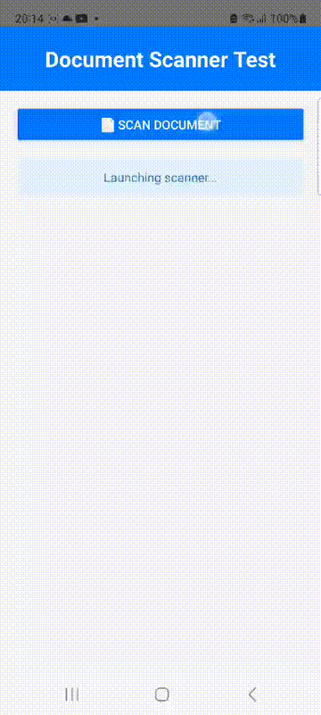
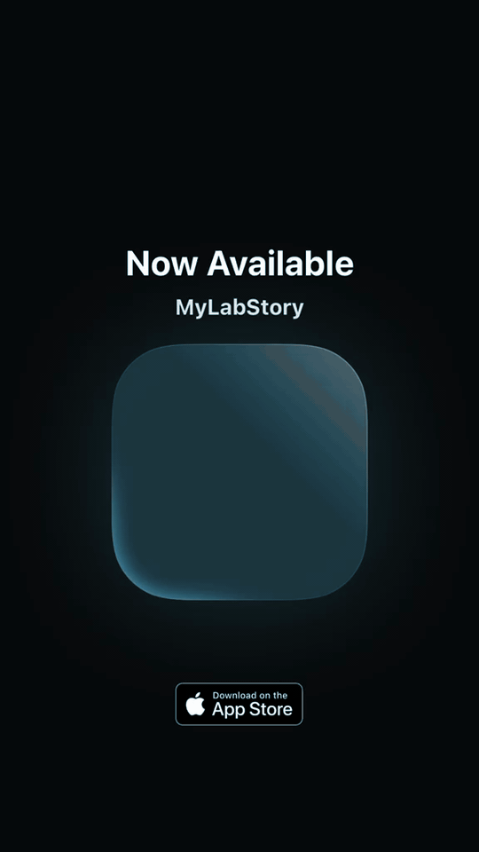

# react-native-document-scanner

[](https://www.npmjs.com/package/@dariyd/react-native-document-scanner) [](./LICENSE)

Fast, native React Native document scanner for iOS and Android using Apple VisionKit (iOS) and Google ML Kit (Android). Features automatic document detection, edge/perspective correction, multi‑page scanning, configurable image quality, optional Base64, and support for the React Native New Architecture on ios and android.

- **iOS**: Uses VisionKit framework and VNDocumentCameraViewController
- **Android**: Uses ML Kit Document Scanner API

## Preview

| iOS Demo | Android Demo |
|----------|--------------|
|  |  |


## Used in Production Apps

| [FileNest AI - Docs Organizer](https://apps.apple.com/us/app/filenest-ai-docs-organizer/id6756841050) | [MyGarage - CarDocs & History](https://apps.apple.com/us/app/mygarage-cardocs-history/id6757166595) | [MyLabStory](https://apps.apple.com/us/app/mylabstory/id6757186292) |
|:---:|:---:|:---:|
| [](https://apps.apple.com/us/app/filenest-ai-docs-organizer/id6756841050) | [](https://apps.apple.com/us/app/mygarage-cardocs-history/id6757166595) | [](https://apps.apple.com/us/app/mylabstory/id6757186292) |

## Features

- 📱 Cross-platform support (iOS 13+ and Android API 21+)
- 🚀 iOS & Android: Full support for new React Native architecture (Fabric/TurboModules)
- 📸 Automatic document detection and scanning
- 🖼️ Multi-page document scanning
- ⚙️ Configurable image quality
- 📐 Optional max width/height to cap image size
- 📄 Android: optional PDF output and configurable ML Kit scanner (page limit, gallery import, scanner mode)
- 📦 Optional base64 encoding
- 🎯 Platform parity - same API for both platforms

> Keywords: React Native document scanner, VisionKit document scanner, ML Kit document scanner, scan documents React Native, edge detection, perspective correction, multi‑page scanner

## Installation

### From npm (Recommended)

```bash
npm install @dariyd/react-native-document-scanner
```

or with yarn:

```bash
yarn add @dariyd/react-native-document-scanner
```

### From GitHub (Latest Development)

```bash
npm install https://github.com/dariyd/react-native-document-scanner.git
```

or

```bash
yarn add https://github.com/dariyd/react-native-document-scanner.git
```

### iOS Installation

```bash
cd ios && pod install
```

### Android Installation

No additional steps required. The ML Kit dependency will be automatically included.

## Post-install Steps

### iOS

Add the `NSCameraUsageDescription` key to your `Info.plist`:

```xml
<key>NSCameraUsageDescription</key>
<string>We need access to your camera to scan documents</string>
```

### Android

Add camera permission to your `AndroidManifest.xml`:

```xml
<uses-permission android:name="android.permission.CAMERA" />
```

The module automatically requests camera permission when launching the scanner.

## React Native New Architecture

This module requires **React Native 0.77.3 or higher** and supports the new architecture on iOS, while using the stable old architecture on Android.

**iOS**: Full support for Fabric and TurboModules - automatically detected and enabled when you enable new architecture in your project.

**Android**: Uses the stable bridge implementation for maximum compatibility. New architecture support is planned for a future release.

### Requirements

- **React Native 0.77.3 or higher**
- **React 18.2.0 or higher**
- iOS 13.0 or higher
- **Android**:
  - Minimum SDK: API 21 (Android 5.0)
  - Target SDK: API 35 (Android 15) - required by Google Play Store
  - Compile SDK: API 35

### Enabling New Architecture

**✅ iOS**: Fully supported - Set `RCT_NEW_ARCH_ENABLED=1` in your Podfile or build settings

**✅ Android**:  Fully supported - Keep `newArchEnabled=true` in your `gradle.properties`

The iOS implementation will automatically use Fabric/TurboModules when enabled, while Android will continue to use the stable bridge implementation.


## Usage

```javascript
import { launchScanner } from 'react-native-document-scanner';

// Basic usage
const result = await launchScanner();

// With options
const result = await launchScanner({
  quality: 0.8,
  includeBase64: false,
});

// With EXIF metadata
const result = await launchScanner({
  quality: 0.8,
  includeExif: true,
});
console.log('EXIF:', result.images[0].exif);

// With EXIF + GPS location
const result = await launchScanner({
  quality: 0.8,
  includeExif: true,
  includeLocationExif: true,
});
console.log('GPS:', result.images[0].exif?.GPSLatitude, result.images[0].exif?.GPSLongitude);

// Cap image size (e.g. to keep uploads small)
const result = await launchScanner({
  quality: 0.85,
  maxWidth: 2048,
  maxHeight: 2048,
});

// Android only: configure the ML Kit scanner and get a PDF too
// (these options are ignored on iOS, `result.pdf` is never set there)
const result = await launchScanner({
  pageLimit: 20,
  galleryImportAllowed: true,
  scannerMode: 'base_with_filter',
  includePdf: true,
});
console.log('Images:', result.images);
if (result.pdf) {
  console.log('PDF:', result.pdf.uri, result.pdf.pageCount, 'pages');
}

// With callback (optional)
launchScanner({ quality: 0.9 }, (result) => {
  if (result.didCancel) {
    console.log('User cancelled');
  } else if (result.error) {
    console.log('Error:', result.errorMessage);
  } else {
    console.log('Scanned images:', result.images);
  }
});
```
# API Reference

## Methods

```js
import {launchScanner} from 'react-native-document-scanner';
```

### `launchScanner()`

Launch scanner to scan documents.

See [Options](#options) for further information on `options`.

The `callback` will be called with a response object, refer to [The Response Object](#the-response-object).


## Options

| Option              | iOS | Android | Description                                                                                                                               |
| ------------------- | --- | ------- | ----------------------------------------------------------------------------------------------------------------------------------------- |
| quality             | ✅  | ✅      | Number between 0 and 1 for image quality (default: 1). Lower values reduce file size                                                      |
| includeBase64       | ✅  | ✅      | If true, creates base64 string of the image (Avoid using on large image files due to performance)                                         |
| includeExif         | ✅  | ✅      | If true, embeds EXIF metadata (timestamps, device info, dimensions) in the image file and returns it in the response (default: false)      |
| includeLocationExif | ✅  | ✅      | If true, also embeds GPS coordinates in EXIF. Requires location permission — see [Location Permission Setup](#location-permission-setup) (default: false) |
| locationAccuracy    | ✅  | ✅      | Target accuracy of the embedded location: `'approximate'` (~3 km), `'balanced'` (~100 m) or `'precise'` (best). Also sets which permission level is needed — see [Location Accuracy](#location-accuracy) (default: `'precise'`) |
| requestLocationPermission | ✅ | ✅  | If false, the scanner never prompts for location permission; GPS is embedded only when permission is already granted. Use when your app asks for location itself (default: true) |
| locationPurposeKey  | ✅  | ❌      | Key in `NSLocationTemporaryUsageDescriptionDictionary`. When set, a user who granted only approximate location is asked for temporary precise location if `locationAccuracy` needs it (default: none) |
| maxWidth            | ✅  | ✅      | Max width in pixels. If the scanned image is wider, it is scaled down before encoding (aspect ratio preserved). `0` or omitted = no cap (default: 0) |
| maxHeight           | ✅  | ✅      | Max height in pixels. Works together with `maxWidth` — the smaller scale factor wins so neither side exceeds its cap. `0` or omitted = no cap (default: 0) |
| pageLimit           | ❌  | ✅      | ⚠️ Android only. Max number of pages per scan session. Values below 1 are treated as 1 (default: 10)                                    |
| galleryImportAllowed| ❌  | ✅      | ⚠️ Android only. If true, the user can import images from the gallery instead of the camera (default: false)                             |
| scannerMode         | ❌  | ✅      | ⚠️ Android only. `'base'`, `'base_with_filter'` or `'full'` — see [Scanner Modes](#scanner-modes-android-only) (default: `'full'`)     |
| includePdf          | ❌  | ✅      | ⚠️ Android only. If true, the response also contains a `pdf` object with all pages — see [PDF Object](#pdf-object-android-only). `images` is always returned (default: false) |

> ⚠️ The four options above configure the ML Kit scanner and are **ignored on iOS** — passing them is safe, they simply have no effect there.

### Scanner Modes (Android only)

| Mode               | Description                                                                              |
| ------------------ | ---------------------------------------------------------------------------------------- |
| `base`             | Basic editing: crop, rotate, reorder pages                                               |
| `base_with_filter` | `base` + image filters (grayscale, auto enhancement)                                     |
| `full`             | `base_with_filter` + ML-enabled cleaning (erase stains, fingers, etc.). This is the default |

## The Response Object

| key          | iOS | Android | Description                                                         |
| ------------ | --- | ------- | ------------------------------------------------------------------- |
| didCancel    | ✅  | ✅      | `true` if the user cancelled the process                            |
| error        | ✅  | ✅      | `true` if error happens                                             |
| errorMessage | ✅  | ✅      | Description of the error, use it for debug purpose only             |
| images       | ✅  | ✅      | Array of the selected media, [refer to Image Object](#image-object) |
| pdf          | ❌  | ✅      | ⚠️ Android only. PDF of all pages, only if `includePdf` is true — [refer to PDF Object](#pdf-object-android-only) |

## Image Object

| key       | iOS | Android | Description                                        |
| --------- | --- | ------- | -------------------------------------------------- |
| base64    | ✅  | ✅      | The base64 string of the image (if includeBase64 is true) |
| uri       | ✅  | ✅      | The file uri in app specific cache storage         |
| width     | ✅  | ✅      | Image width in pixels                              |
| height    | ✅  | ✅      | Image height in pixels                             |
| fileSize  | ✅  | ✅      | The file size in bytes                             |
| type      | ✅  | ✅      | The file MIME type (e.g., "image/jpeg")            |
| fileName  | ✅  | ✅      | The file name                                      |
| exif      | ✅  | ✅      | EXIF metadata object (if includeExif is true). See [EXIF Object](#exif-object) |

## PDF Object (Android only)

When `includePdf` is `true` on Android, the response also contains a `pdf` object. It is never present on iOS.

| key       | iOS | Android | Description                                        |
| --------- | --- | ------- | -------------------------------------------------- |
| uri       | ❌  | ✅      | The file uri in app specific cache storage         |
| pageCount | ❌  | ✅      | Number of pages in the PDF                         |
| fileSize  | ❌  | ✅      | The file size in bytes                             |
| type      | ❌  | ✅      | The file MIME type (`"application/pdf"`)           |
| fileName  | ❌  | ✅      | The file name                                      |

> ⚠️ The PDF is built by ML Kit at its own resolution. The `quality`, `maxWidth` / `maxHeight` and `includeExif` / `includeLocationExif` options only apply to the images in `images`, **not** to the PDF.

## EXIF Object

When `includeExif` is `true`, each image includes an `exif` object with the following fields:

| key                  | iOS | Android | Description                                          |
| -------------------- | --- | ------- | ---------------------------------------------------- |
| DateTimeOriginal     | ✅  | ✅      | Scan timestamp (format: `yyyy:MM:dd HH:mm:ss`)      |
| DateTimeDigitized    | ✅  | ✅      | Scan timestamp (format: `yyyy:MM:dd HH:mm:ss`)      |
| PixelXDimension      | ✅  | ✅      | Image width in pixels                                |
| PixelYDimension      | ✅  | ✅      | Image height in pixels                               |
| ColorSpace           | ✅  | ✅      | Color space (1 = sRGB)                               |
| Make                 | ✅  | ✅      | Device manufacturer                                  |
| Model                | ✅  | ✅      | Device model                                         |
| Software             | ✅  | ✅      | App name                                             |
| GPSLatitude          | ✅  | ✅      | Latitude (only if `includeLocationExif` is true and permission granted)  |
| GPSLongitude         | ✅  | ✅      | Longitude (only if `includeLocationExif` is true and permission granted) |
| GPSAltitude          | ✅  | ✅      | Altitude in meters                                   |
| GPSHorizontalAccuracy| ✅  | ✅      | GPS accuracy in meters                               |
| GPSDateTimeUTC       | ✅  | ✅      | GPS fix timestamp in UTC                             |

## Location Permission Setup

When using `includeLocationExif: true`, the package requests location permission when needed (unless `requestLocationPermission: false`). You must add the required permission keys to your app:

### iOS

Add to your `Info.plist`:

```xml
<key>NSLocationWhenInUseUsageDescription</key>
<string>Your location will be embedded in scanned documents for record-keeping.</string>
```

### Android

No additional setup required. The package declares `ACCESS_FINE_LOCATION` and `ACCESS_COARSE_LOCATION` permissions in its own manifest, which will be merged automatically.

### Permission Behavior

- If the permission level needed for `locationAccuracy` has **not been granted yet**, the system dialog appears before the camera opens — asking for exactly that level (approximate for `'approximate'`, precise otherwise)
- If permission was **already granted** at that level, no dialog is shown
- If permission was **denied**, GPS fields are silently skipped and scanning proceeds normally
- With `requestLocationPermission: false` the scanner **never** shows a dialog — ask for location in your app before scanning if you want GPS
- Location permission is **only requested when `includeLocationExif: true`** — it has no effect otherwise

### Location Accuracy

Location is **best-effort and never delays the camera**. The scanner opens immediately; a recent cached fix (less than 5 minutes old) is used straight away, and location updates run while the user scans, keeping the most accurate fix. Updates stop as soon as a fix reaches the `locationAccuracy` target, or when the scanner closes. The best fix obtained is embedded when the scan is saved — `GPSHorizontalAccuracy` and `GPSDateTimeUTC` tell you how precise it is and when it was taken.

| `locationAccuracy` | Target | Permission needed | iOS | Android |
|---|---|---|---|---|
| `'approximate'` | ~3 km | approximate | `kCLLocationAccuracyThreeKilometers` | `ACCESS_COARSE_LOCATION`, `PRIORITY_LOW_POWER` |
| `'balanced'` | ~100 m | precise | `kCLLocationAccuracyHundredMeters` | `ACCESS_FINE_LOCATION`, `PRIORITY_BALANCED_POWER_ACCURACY` |
| `'precise'` | best | precise | `kCLLocationAccuracyBest` | `ACCESS_FINE_LOCATION`, `PRIORITY_HIGH_ACCURACY` |

If only approximate permission is granted while a precise level is requested, the best approximate fix is embedded. A very fast scan with no cached fix, or no location signal (e.g. airplane mode without a recent fix), simply produces an image without GPS.

## Platform Differences

While both platforms provide similar functionality, there are some minor differences:

### iOS
- Uses native VisionKit framework
- Requires iOS 13.0 or higher
- Supports PNG format for quality = 1.0, JPEG for quality < 1.0

### Android
- Uses Google ML Kit Document Scanner
- Minimum SDK: API level 21 (Android 5.0)
- Target SDK: API level 35 (Android 15) - Google Play Store requirement
- Always outputs JPEG format (plus an optional PDF when `includePdf` is true)
- Scanner behavior is configurable via `pageLimit`, `galleryImportAllowed`, `scannerMode` — no iOS equivalents
- Requires Google Play Services

## Troubleshooting

### Android: ML Kit not available

If you encounter issues with ML Kit on Android, ensure that:
1. Google Play Services is installed on the device/emulator
2. Your `compileSdkVersion` is 35 or higher
3. Your `targetSdkVersion` is 35 (required by Google Play Store)
4. Your `minSdkVersion` is 21 or higher

### iOS: Camera permission denied

Ensure you've added the `NSCameraUsageDescription` key to your `Info.plist`.

## Example

Check the `example/` directory for a complete example app demonstrating the scanner.

## Inspired By

- iOS implementation: [react-native-image-picker](https://github.com/react-native-image-picker/react-native-image-picker)
- Android ML Kit: [Google ML Kit Document Scanner](https://developers.google.com/ml-kit/vision/doc-scanner)

## License

MIT
